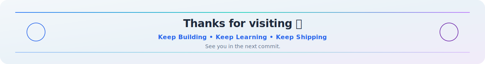

  

  
   

  
  
  
  
  

---

### 👤 Explore My World

Backend-heavy Full Stack Developer based in **Addis Ababa, Ethiopia 🇪🇹** *Focused on building secure, production-ready, and highly scalable ecosystem architectures.*

<table width="100%">
<tr>
<td width="33%" valign="top" align="center">
<h4>🎯 Core Philosophy</h4>
<small>
Production-ready  
Secure by default  
Maintainable & Scalable  
Developer-friendly  
</small>
</td>

<td width="34%" valign="top" align="center">
<h4>🚀 Current Focus</h4>
<small>
Open Source Laravel Packages  
Payment Infrastructure  
API Aggregators & Design  
Redis & System Design  
</small>
</td>

<td width="33%" valign="top" align="center">
<h4>🎓 Stats & Experience</h4>
<small>
<strong>Dilla University</strong>  
CGPA: 3.71 / 4.00  
Exit Exam: 81 / 100  
Contributed to <strong>AAHDC & AAHDAB</strong> systems
</small>
</td>
</tr>
</table>

---

  

---

### 🚀 Flagship Project

## 💳 Telebirr PHP & Laravel SDK

Production-ready Telebirr SDK built for **Laravel** and **Vanilla PHP**.

`Secure` • `Deterministic` • `Production Ready`

 

  

| 🔐 Security | ⚡ Performance | 📦 Developer Experience |
|-------------|---------------|--------------------------|
| <small>RSA-PSS Signing</small> | <small>Replay Protection</small> | <small>Easy Laravel Integration</small> |
| <small>Webhook Verification</small> | <small>Canonical Requests</small> | <small>Vanilla PHP Support</small> |
| <small>Secure Callbacks</small> | <small>H5 & SuperApp</small> | <small>Well Documented</small> |

 

---

### 📂 More Ecosystem Projects

<table width="100%">
<tr>
<td width="33.3%" valign="top">

#### ⚽ FootyLive
<small>Backend-focused football live score platform.</small>
* <small>⚡ REST APIs & Live Updates</small>
* <small>🏗 Match Tracking Stack</small>
 

</td>

<td width="33.3%" valign="top">

#### 🎬 Watchers Heaven
<small>Modern OTT-inspired streaming concept platform.</small>
* <small>🎥 Responsive UI Architectures</small>
* <small>🚀 Open Source Foundations</small>
 

</td>

<td width="33.3%" valign="top">

#### 🚛 Fleet Management
<small>Enterprise resource logistical tracking platform.</small>
* <small>📊 Telemetry & Asset Tracking</small>
* <small>🛡 High-reliability Control Systems</small>
 

</td>
</tr>
</table>

---

### 🛠 Technical Expertise

<table width="100%">
<tr>
<td width="33.3%" valign="top" align="center">
<h4>⚡ Backend Engine</h4>

</td>
<td width="33.3%" valign="top" align="center">
<h4>🎨 Frontend UI</h4>

</td>
<td width="33.3%" valign="top" align="center">
<h4>🏗 Infrastructure</h4>

</td>
</tr>
</table>

---

### 📊 GitHub Dashboard Metrics

  <table width="100%">
    <tr>
      <td width="38%" align="center">
        
      </td>
      <td width="38%" align="center">
        
      </td>
      <td width="24%" align="center">
        
      </td>
    </tr>
  </table>

---

  

    
  

  

    
  

  
<small>If one of my projects made your day a little easier, consider leaving a ⭐. It helps push open-source forward!</small>

  
  
    
  

